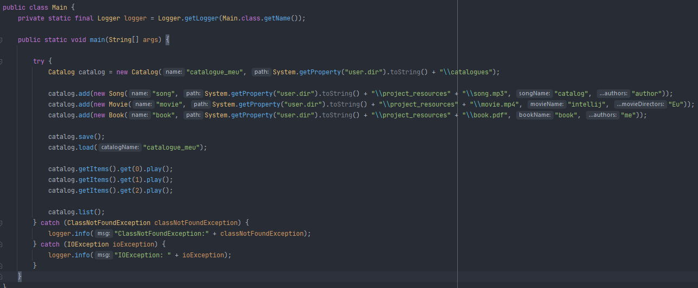
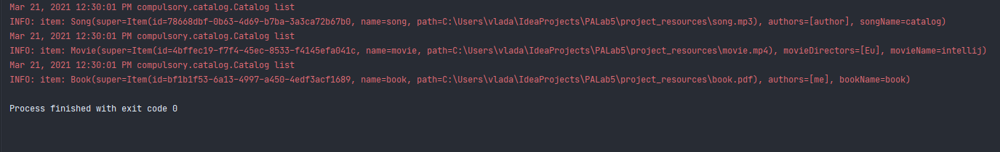
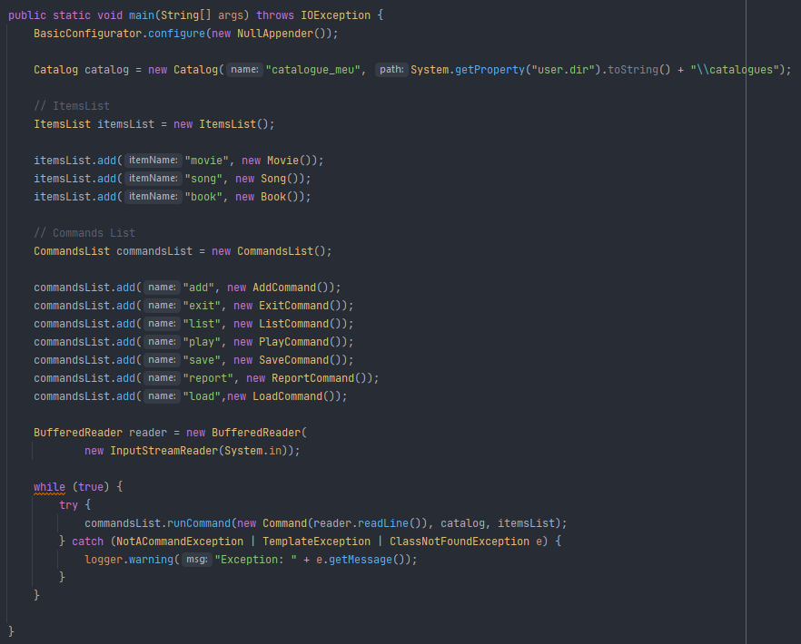
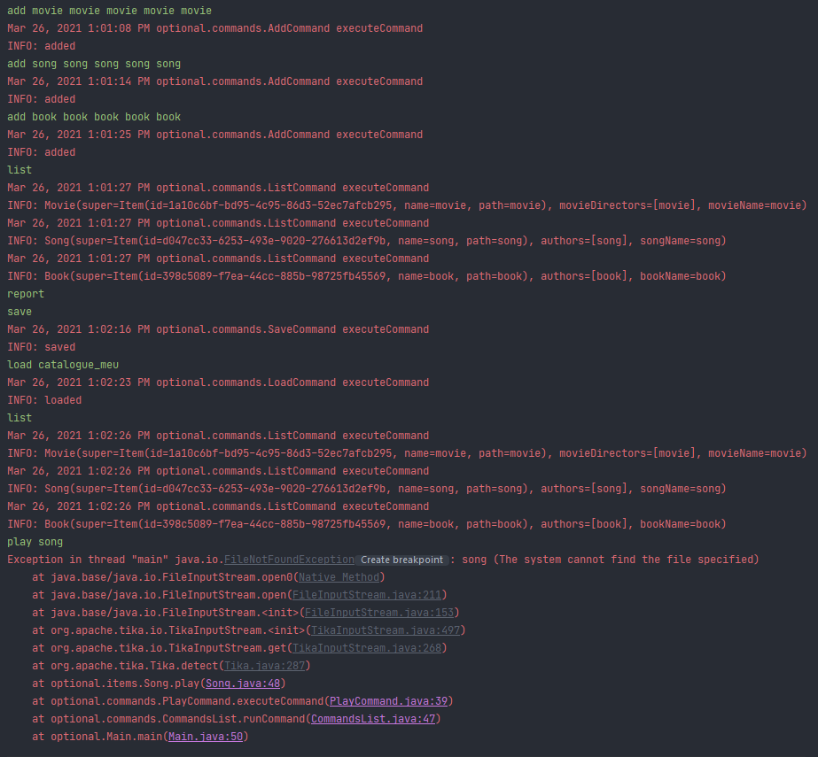
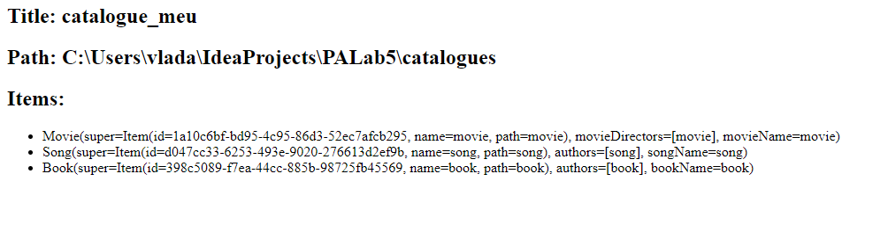
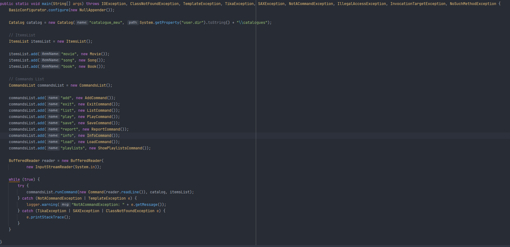
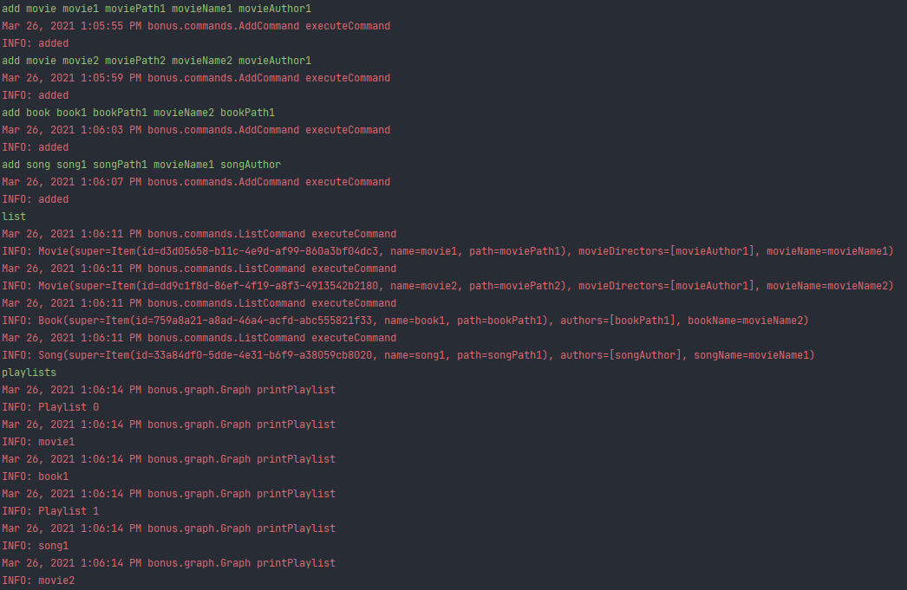
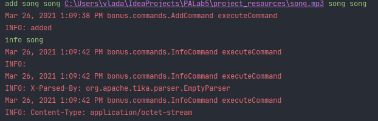

# Advanced Programming - Lab 5

This repository contains all the problems proposed for the fifth laboratory in Advanced Programming course
solved by me.

## Essential tools

You need to have Java RE or JDK >= 8 installed on your computer.

## How to run it?

1. Open project with IntelliJ IDEA

Clone this repository and open it with IntelliJ IDEA. Build this project
(shortcut Ctrl+F9) then go to Run->Run...(shortcut Alt+Shift+F10) and select
the file you want to run.

2. Compile and run the programs using CMD

Go to the folder where the file is located. Open a new terminal here.

If you want to compile the file Main.java you must type the command.

```bash
javac -d . Main.java
```

After you compiled it, if you want to start the program you can type the
following command

```bash
java packageName.Main
```

where to packageName is the name of the package which includes the file Main.java.

## Problem

### Media Catalog

Write an application that can manage a catalog of multimedia items. An entry in this catalog might be a song, a movie, a book, an image or any item that has at least a name and a path in the local file system. (We may also consider specifying a release year, a rating and other additional data, for example the author of the book, etc.)

## Tasks

### Compulsory

- [x] Create an object-oriented model of the problem. You should have at least the following classes: Catalog and two item classes at your choice. Consider using an interface or an abstract class in order to describe the items in a catalog.
- [x] Implement the following methods representing commands that will manage the content of the catalog:
    - add: adds a new entry into the catalog;
    - list: prints the content of the catalog on the screen; 
    - play: playback using the native operating system application (see the Desktop class);
    - save: saves the catalog to an external file (either as a text or binary, using object serialization);
    - load: loads the catalog from an external file.
- [x] The application will signal invalid data (year, path, etc.) using a custom exception.




### Optional

- [x] Create a shell that allows reading commands from the keyboard, together with their arguments.
- [x] Represent the commands using classes instead of methods. Use an interface or an abstract class in order to desribe a generic command.
- [x] Implement the commands add, list, save, load, play (create the classes AddCommand, ListCommand, etc.).
- [x] Implement the command report: create (and open) an HTML report representing the content of the catalog.
Use a template engine such as FreeMarker or Velocity, in order to create the HTML report.
- [x] The application will signal the commands that are not valid using a custom exception.
- [x] The final form of the application will be an executable JAR archive. Identify the generated archive and launch the application from the console, using the JAR.





### Bonus

- [x] Use Apache Tika in order to extract metadata from your catalog items and implement the command info in order to display them.
- [x] Create a graph G in which the catalog items represent the nodes, two nodes being connected if they share some common feature (for example, two songs that have the same artist, etc).
- [x] Suppose that you want to play all the items in the catalog in as few days as possible, so that in one day you will not play two items that are connected in G. Create an algorithm that generates the playlists for each day.
- [x] Create large graphs and test your algorithm.





